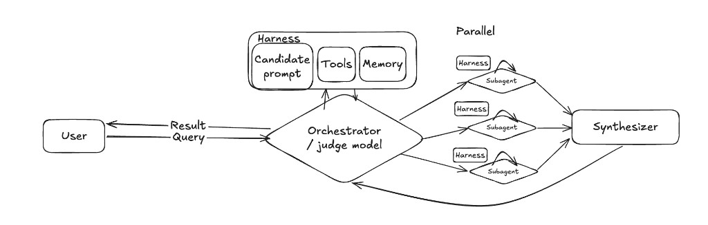
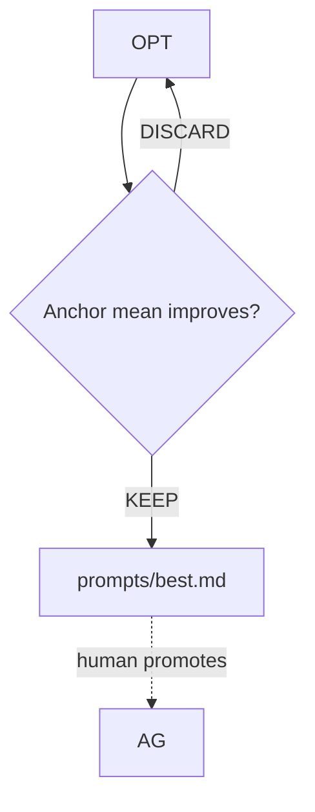
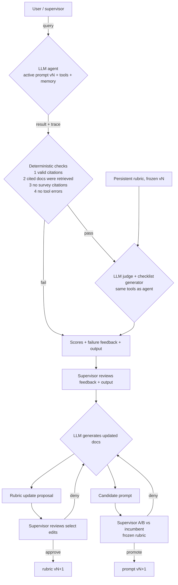
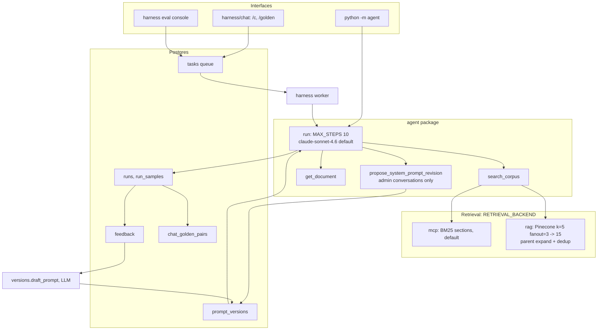

# The New Bagehot Project

**AI agents for financial crisis intervention.** An LLM agent answers policy questions against a corpus of crisis surveys and episode case studies: which precedent applies, what a lender of last resort should do, and when the textbook answer is the wrong one. We designed this as a decision-making assistant for central banks and policymakers around the world.

## 1. Starting point

We used the multi-agent research system proposed by [Anthropic](https://www.anthropic.com/engineering/multi-agent-research-system) as a starting point.



The **anchor set is the headline metric**. LLM-generated cases expand coverage cheaply and probe situations nobody would write by hand. When an optimizer improves the generated mean while the anchor mean falls, the change is discarded.



Our aim was to build a robust evaluation and review system on top of this vanilla LLM-as-judge architecture, where the human expert is more in-the-loop. Financial crisis expertise has tons of subtleties that are not accurately captured in vanilla LLM outputs.

## 2. The two-loop supervisor system



**Deterministic checks run before the judge and can veto promotion outright.** Whether a cited document was ever retrieved is a fact, not an opinion. Spending judge tokens on it is waste, and a judge that scores around it is how a bad prompt gets promoted.

**The rubric and the prompt never move in the same cycle.** If both change, a score difference cannot be attributed to either one, and the evaluation run teaches nothing. The rubric is frozen during prompt A/B; the prompt is frozen during rubric revision.

---

## 3. What is actually running today



We tried the full two-loop version. The operational overhead for the reviewers was too high, so we cut the judge and the rubric. What runs today is the **no-judge, no-rubric** system above.

---

## 4. Retrieval: measured behavior

One key design decision was figuring out whether or not to implement a vector-based RAG approach or a `ripgrep` based MCP server approach for document retrieval.

Three benchmark scenarios, run against Opus with no system prompt so that backend behavior is isolated from prompt steering: **Q1**, an insurer liquidity crisis; **Q2**, private-debt-fund contagion; **Q3**, an AI-collateral shock.

```
             searches  get_document  words   agent steps
Q1 no-rag         —          —        560      1
Q1 rag            5          1       1257      3
Q1 mcp            3          1       1330      2
Q2 no-rag         —          —        695      1
Q2 rag           10          —       1386      2
Q2 mcp            4          —       1651      2
Q3 no-rag         —          —        616      1
Q3 rag            9          —       1286      2
Q3 mcp            4          —       1393      2
```

**Content converges; cost does not.** Both backends reach the same precedent set, and RAG spends two to three times the tool calls getting there. The traces show why: each narrow child-embedding hit satisfies one sub-question, so the gap-detection loop issues another query for the next missing pillar.

Three defects in the RAG path account for most of that overhead.

**Parent expansion had silently degraded.** Every hit's `text` began with `Document: Blanket Guarantees Survey\n\n...`, which is the ingestion-side `embedding_text` rather than the expanded parent section, and `matched_text` was always empty. That is the signature of `chunks/` missing from disk, leaving the chunk index empty. Nothing errored; the backend simply returned worse context. After we fixed this, RAG still significantly had more `search_corpus` tool calls than MCP.

**No diversity control.** Pure cosine top-k, no MMR, no per-document cap. One document with 145 near-matching vectors monopolized all 15 slots: on one query every hit came from `vol4_iss4_4`, on another all 15 from `vol7_iss1_1`.

**The similarity band is tight**, 0.57 down to 0.52. Everything is pretty good and nothing is great, which is what a corpus of near-synonymous policy prose looks like through an embedding model.

**`get_document` is rarely called.** Section snippets were enough to produce a 1,400-word memo, and neither backend fetched the full SCAP case study even after it surfaced in search. Our qualitative tests with domain experts indicate full-document grounding is not necessary. However, we might see a need in the future for more detailed responses.

---

## 5. Source hierarchy → source roles

We started with "surveys outrank all," enforced three ways: a hard-coded `TYPE_RANK` sort in `search_corpus`, a line in the system prompt, and the evidence-synthesis skill. The memos came back confident and well-structured, but each one cited a single survey and nothing else. The constraint was doing exactly what we asked.

The failure pointed at the wrong ranking dimension. **Rank by claim type, not by document type.**

| Claim type | Corpus role | Cite as |
|---|---|---|
| Analytic frame: design dimensions, tradeoffs, option menus | Survey, loaded early to shape reasoning | `(Survey: vol4_iss2_3 — framework)` |
| Episode facts: what was done, scale, uptake, outcomes | Case study, plus lessons-learned for judgment | `(Case study: vol4_iss2_63)` |
| Application to the principal's situation | Inference, explicitly labeled | `(Inference)` |
| Conflict | Survey sets the frame; case study wins on episode specifics | show both |

"Search surveys first" was the next attempt. It produced the same failure in a different shape. What worked was a two-pass retrieval discipline with a budget: a frame pass over one or two surveys, then an evidence pass over two to four case studies. A later iteration tightened the prompt further: surveys shape reasoning but are never cited. That became the fourth deterministic gate (`no survey citations`) in the shipped `agent/system_prompt.md`.

---

## 6. Domain learnings that changed the prompt

Working through the material with the subject-matter expert reframed the vocabulary. We realized that the vocabulary we used in tool definitions and system prompts led to bad answers.

**Bagehot's rule is "lend freely against good collateral at high rates,"** and Bagehot never reasoned about solvency or moral hazard at all. With genuinely good collateral there is no need to. You can just sell the gold.

**"Solvency" is the wrong lens; "viability" is the right one.** Silicon Valley Bank was technically insolvent immediately before the run and highly viable: borrowing at 2% against a 5% market, a three-point margin, lenders still lending normally. The insolvency label triggered the panic. An agent that mechanically applies a solvency test does not merely miss this, it reproduces the original error.

**"Moral hazard" carries no moral content.** It names an information asymmetry that appears *after* funds are committed. Models reach for it as a normative argument, and every time they do the analysis is corrupted.

**Punitive pricing backfires twice.** It deters borrowing, and any institution that borrows anyway is publicly marked as desperate. The result is a system full of institutions running below capacity. "Lend freely" survives from Bagehot. "At a penalty rate" largely does not.

---

## 7. Evaluation: what we concluded

**What the supervisor should see.** Showing everything burns the reviewer out. Instead, we show the reviewer the diff of the proposed system prompt against the pre-existing system prompt. All previous actions that the supervisor needed to take to rate system prompt output (forms, selection boxes, etc.) simplified to just a highlight-and-comment user experience.

**Why the rubric got cut.** A trustworthy rubric version needs lineage, examples, activation frequency, and validation results. Validation is impossible without labeled data, and labeled data is slower to obtain than golden pairs collected directly. So the system collects golden pairs first and defers the judge.

**Reproducibility.** Non-determinism at temperature 0 is real, and it comes mostly from batched MoE inference rather than from sampling. Seeds help without eliminating it. Any model comparison needs multiple samples per case, which is why the harness runs 1–20 samples per case rather than one.

---

## 8. Agent-engineering learnings

- Context quality starts degrading around **25% window fill**, not at 100%. Budget accordingly.
- Bloated toolsets are the dominant failure mode. Three MCP servers can consume 143K of a 200K window in tool descriptions alone, and tool-selection accuracy falls from 43% to 14%. **This project ships two tools**, with one admin-only tool injected per run via `tools=` / `dispatch_fn=` rather than mutated into the global registry.
- Keep personality separate from operational instructions, a convergent finding across Claude Code, OpenClaw, and Hermes.
- Re-inject key instructions near the end of context to counter instruction centrifugation as the window fills.
- Skills as markdown, not code, with progressive tiered loading.
- Start from a minimal prompt on the best available model, then add instructions only for failures actually observed. A few canonical few-shot examples beat enumerating every edge case.
- Make the tool trace a first-class return value. `run()` returns `(answer, messages)`, and every eval check, gate, and UI timeline is built on that trace. Retrofitting it would have been expensive.
